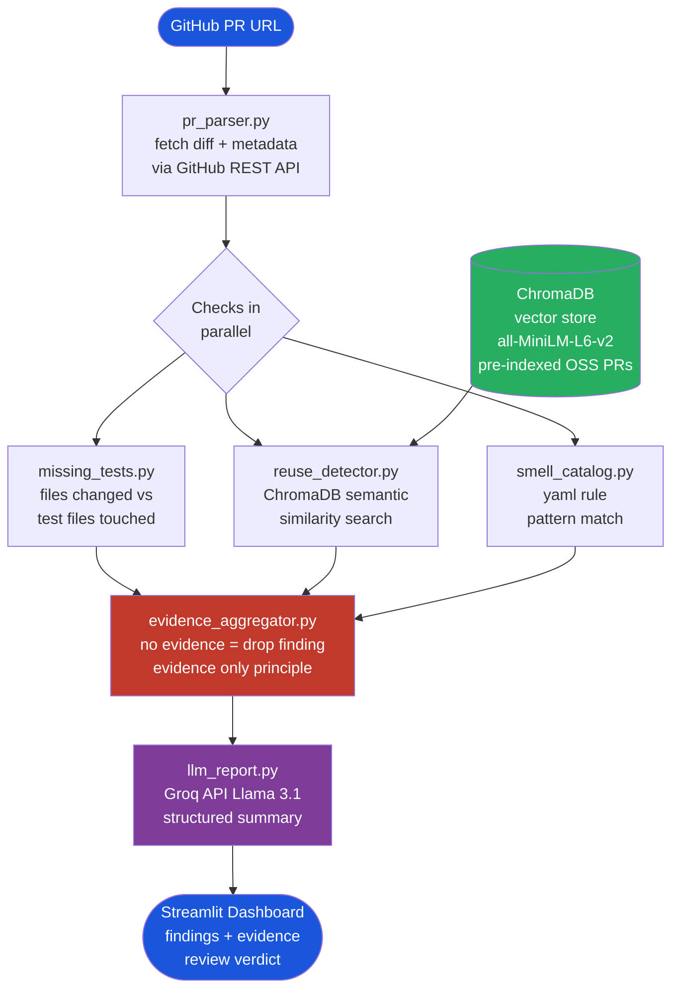

```mermaid
flowchart TD
    A(["GitHub PR URL"]) --> B["pr_parser.py<br>fetch diff + metadata<br>via GitHub REST API"]

    B --> C{"Checks in<br>parallel"}

    C --> D["missing_tests.py<br>files changed vs<br>test files touched"]
    C --> E["reuse_detector.py<br>ChromaDB semantic<br>similarity search"]
    C --> F["smell_catalog.py<br>yaml rule<br>pattern match"]

    G[("ChromaDB<br>vector store<br>all-MiniLM-L6-v2<br>pre-indexed OSS PRs")] --> E

    D --> H["evidence_aggregator.py<br>no evidence = drop finding<br>evidence only principle"]
    E --> H
    F --> H

    H --> I["llm_report.py<br>Groq API Llama 3.1<br>structured summary"]

    I --> J(["Streamlit Dashboard<br>findings + evidence<br>review verdict"])

    style A fill:#1a56db,color:#fff
    style J fill:#1a56db,color:#fff
    style H fill:#c0392b,color:#fff
    style G fill:#27ae60,color:#fff
    style I fill:#7d3c98,color:#fff
```
